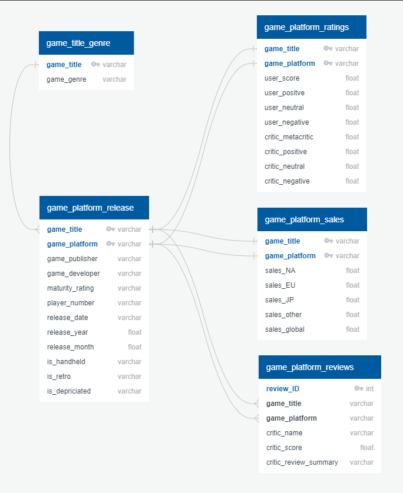
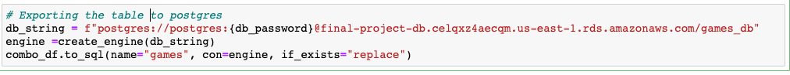
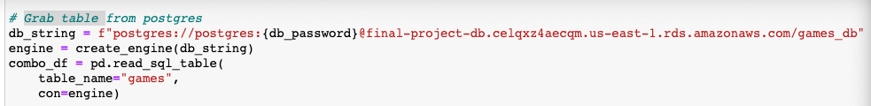

# Predicting the Future of Gaming
## Project Outline
#### Topic & Background
Video games have been around since the mid-1900s, but it was not until milestones such as the release of PacMan and Nintendo’s creation of Donkey Kong in 80s that the industry really started to boom. Through the eras of arcade gaming, the development of multiplayer games, and then to the creation of home gaming consoles -the population of global players has steadily continued to rise [1]. In 2020 alone, the gaming industry has yielded a total revenue of 159.3 billion -up 9.3% from 2019. It has also accounted for 2.7 billion players globally -up 5.3% from 2019. In fact, it is forecasted that the gaming market revenue will grow to $200.8 billion and the global player count will rise to 3.07 billion by 2023 [2].

#### Purpose
With the increasing popularity and plethora of available games, our group will trend historical gaming data to analyze what makes a game successful. By doing so, it becomes possible to aid publishers and developers in releasing products aligned with current and future consumer interests.
1.	Chikhani, Riad. “The History Of Gaming: An Evolving Community.” TechCrunch, TechCrunch, 31 Oct. 2015, techcrunch.com/2015/10/31/the-history-of-gaming-an-evolving-community/.

2.	Tim Wijman. “2020 Global Games Market Report”. NewZoo. Accessed 05 December 2020.

### Reason for Selection
The reason we selected this particular topic is in order to truly understand the impact of the multi-billion dollar gaming industry and how this knowledge can benefit video game developers who are attempting to successfully create and release a video game.

### Questions to Answer

A. What Makes a video game successful?
- What genre of games is the most successful across all platforms?
- Do cross platforms games sell better than singular platforms?
- Do video games that are single player sell better than multiplayer?
- Do video games sell better digitally or as hard copies in stores?

B. What is the best time to release a video game?
- Do video games sell better in a certain time of the year?
- How do the holidays affect video game sales?
- How does world events affect video games?

C. How does demographic / location effect video game sales?
- What part of the world plays / purchases the most games?
- What demographic plays / purchases the most video games?

---
### Communication protocols
* Slack
  - Comunication outside of Zoom meetings are done through Slack. This is used to give general updates about where we are at on our specific portions and set up meeting times, as well as to alert others about commit/merges to the repository.
* Zoom
  - Any group meetings outside of the regularly scheduled class are done through Zoom meetings.
---
### Machine Learning Model and Data Scrape
[Metacritic_ETL.ipynb](./Notebooks/Metacritic_ETL.ipynb)
* scraped data from metacritic.com
* performed ETL on the data and imported it into Postgres using SQL Alchemy.
* exported data to a csv file for later use.

[Metacritic_Comment_Scraping.ipynb](./Notebooks/Metacritic_Comment_Scraping.ipynb)
* scraped review data from metacritic.com
* performed ETL on the data and imported it into Postgres using SQL Alchemy.
* exported data to a tab-delimited csv file for later use.

[Exploratory_Analysis.ipynb](./Notebooks/Exploratory_Analysis.ipynb)
* cleaned data
* merged our scraped data as well as the game data from vgsales.csv
* exported data using sqlalchemy to postgres

[Predicting_Sales.ipynb](./Notebooks/Deep_Learning_Model.ipynb)
* performed feature engineering
* used Random Forest to interpolate missing values in the dataset.
* scaled the data for supervised and unsupervised Learning
* clustered data using KMeans
* created a deep artificial neural network to predict Sales.

[Clustering_Class_Module.py](./Notebooks/Clustering_Class_Module.py)
* .py file containing the class for clustering features using KMeans
* takes in X and y and uses a set of methods to choose the best k value and cluster the model
* Is imported into Predicting_Sales.ipynb.

[Keras_Class_Module.py](./Notebooks/Keras_Class_Module.py)
* .py file containing the class for instantiating a deep neural network.
* takes in X an y and uses a set of methods to split the data into training/testing sets as well as scale the data and create a model which we then make predictions off of.
* Is imported into Predicting_Sales.ipynb.

NOTE: Descriptions of the machine learning deliverables process can be
found in the notebook itself written in markdown language inbetween the code
and in code comments.

Machine Learning Description:

To make accurate predictions using the model we did feature engineering on the
release date column to get new features for year and month. The month a game is
released may have some correlation with the overall sales. Then we cleaned the dataset
and used ensemble learning to interpolate missing values. Our data was very dirty so
I used unsupervised learning to try to glean insights and patterns about our data.
The takeaway was that there is only a loose correlation between reviews and Sales.
I opted to not include Developer and Producers into the deep learning model because
even after binning there were simply too many categories to one hot encode into the
model.

I knew the data was dirty and therefore would take some fiddling with input data
to arrive at a good model so I incorporated OOP (Object-Oriented Programming) to
make this process less cluttered in the notebook. Data is then split within one of
the DeepLearning class's methods.

I am choosing a neural network, because they are adept at picking up subtle correlations between combinations of features and the label. Our data is attempting to predict a label off of features that appear only loosing correlated with Sales. My hope is that the deep learning model can pick up subtle patterns from all this review data along with our other features to make accurate predictions about sales. A limitation of this Model
will be that I cant fully understand what is happening inside the model. I think
this will be outweighed however by the benefits relating to the patterns and relationships
it will be able to pick up.

I determined that for several reasons this data may be unfit to predict sales on.
The Sales data is biased in favor of games that have been out longer because they
have more time to accumulate sales. Most games in the data has near zero sales, with
a not insignificant proportion of games selling much more. Our model therefore can
be trained to be a good predictor of games perhaps in one range or another but not both.
To account for this, I dropped all the games that could be considered outliers for
each category of Sales, yet still was not getting great results.  I opted to see if I
could make accurate predictions for just one region, North America Sales (NA_Sales). The
results were far better, supporting my hypothesis but the model as a whole was still
not a great predictor.  

#### Factors that limited the efficacy of the models
* Sales data was too rightly-skewed
* The features we used were simply not good predictors of Sales, even when taken in aggregate.
* Gamer's attitudes towards a given games, and thus sales, cannot be adequately encapsulated by generic features. Ultimately, whether a game is popular or not is a
function of qualities of the game that are much more subtle. A good game can come from anywhere.

#### Features that could strengthen the models
* Sales data that is more granular could help to strengthen the model. "Japan Sales" or "North American Sales" is still too broad of a category to predict accurately.
* A more even spread of the Sales data that is less right-skewed.
* A subset of games that are more current and have more in common.

* NOTE: The developer column in the combo_df file was corrupted at some point. The script still works, but all values are null.

---

### Database
* Imported table from postgres to [Deep_Learning_Model.ipynb](./Notebooks/Deep_Learning_Model.ipynb) using sqlalchemy
* Designed database ([schema](./Database/schema.sql))

  #### ERD
  

Export
:-------------------------:
|

Import
:-------------------------:
|

---
### Dashboard

---

## Responisbilites
---
### Blake Kennedy
---
#### Segment 1
* Database
  * Imported table from postgres to [Deep_Learning_Model.ipynb](./Notebooks/Deep_Learning_Model.ipynb) using sqlalchemy
  * Designed database ([schema](./Database/schema.sql))
#### Segment 2
* Database
  * Drafted various ERD and updated schema with Michelle
* Dashboard
  * Created dashboard blueprint with tableau
#### Segment 3
#### Segment 4
---
### Joseph Thompson (NOTE: Branch name is "New_Branch")
---
#### Segment 1
[Metacritic_Scraping_Pipeline.ipynb](./Notebooks/Metacritic_Scraping_Pipeline.ipynb)
* scraped data from metacritic.com
* exported data to a csv file for later use.

[Exploratory_Analysis.ipynb](./Notebooks/Exploratory_Analysis.ipynb)
* cleaned data
* merged our scraped data as well as the game data from vgsales.csv
* exported data using sqlalchemy to postgres

[Deep_Learning_Model.ipynb](./Notebooks/Deep_Learning_Model.ipynb)
* performed feature engineering
* scaled data
* created a deep artificial neural network

#### Segment 2
[Metacritic_Comment_Scraping](./Notebooks/Metacritic_Comment_Scraping.ipynb)
* added another scraping script to gather review data for later use with NLP.

* altered the scraping scripts to upload into the new Postgres database schema.
* added unsupervised clustering models to Deep_Learning_Model.ipynb
* Used Random Forest to interpolate missing values in the MI dataset.
* implemented object-oriented programming into Keras deep learning models and clustering models
* wrote commentary into Deep_Learning_Model.ipynb that explains preprocessing, feature selection, why I chose the models i did, and all other details relating to the machine learning deliverable.
* Wrote an overview of the Machine Learning sections of the project in the README.md file that meet the requirements of the deliverable in conjunction with the notes written in with the code.

#### Segment 3
#### Segment 4
---
### Maria Castellanos
---
#### Segment 1
* Topic & Background: Introduced prevalance of gaming and evidence of booming market.
* Purpose: Introduced the possibility of using historical gaming data for the the development and production of future games.
#### Segment 2
* Slides and Presentation: Began first phase of presentation organization and editing.
#### Segment 3
#### Segment 4
---
### Michelle Johnson
---
#### Segment 1
* GitHub
  * Created the repository and branches.
  * Made formatting edits in readme for continuity.
  * Added links to files.
#### Segment 2
* GitHub
* Database
  * Updated schema and ERD with Blake.
  * Created created queries file.
#### Segment 3
#### Segment 4
---
### Nicholas Singh
---
#### Segment 1
* Reason for Selection
* Questions to Answer

#### Segment 2
* Slides and Presentation
    * Added multiple images along with multiple slides explaining the processes behind the data source, exploration and analysis.
#### Segment 3
#### Segment 4
---
